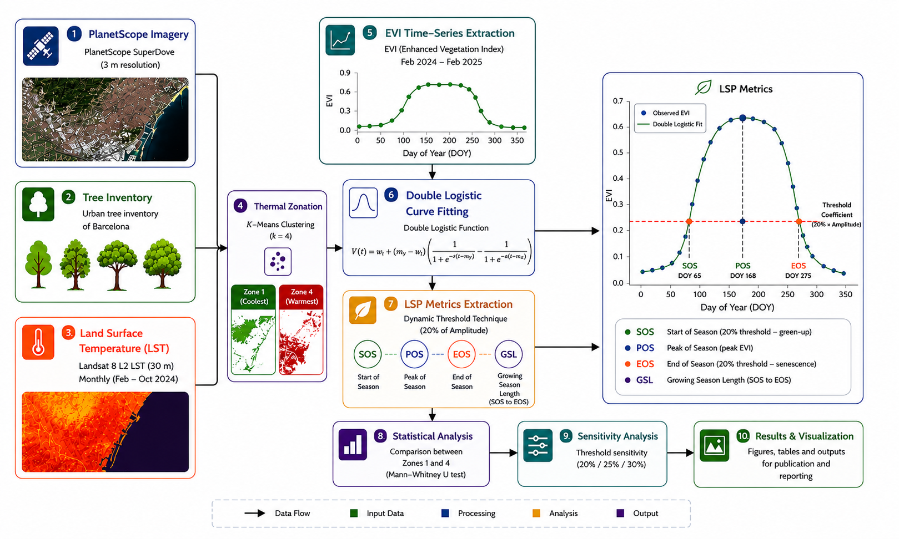
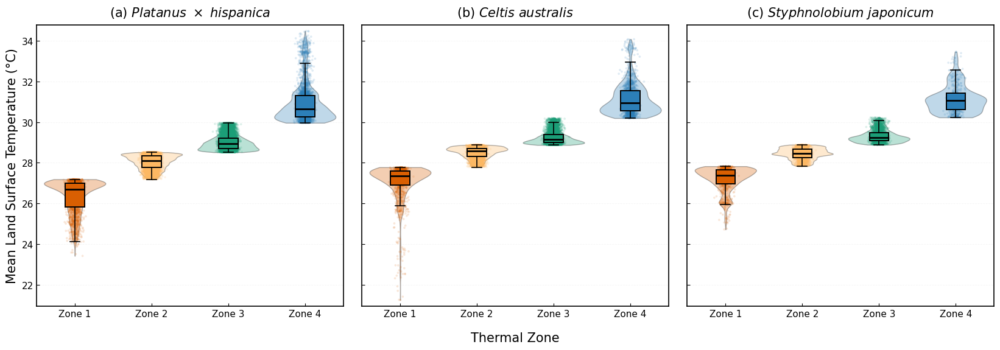
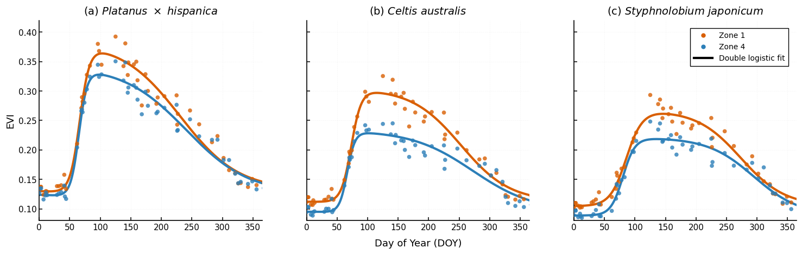
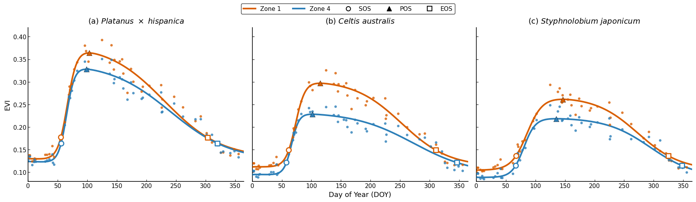

# Assessing the Urban Heat Island Effect on Tree Phenology Using High-Resolution Satellite Imagery

*A reproducible Python workflow for investigating the influence of the Urban Heat Island (UHI) on urban tree phenology using high-resolution PlanetScope SuperDove imagery.*

[](https://www.python.org/)
[](https://colab.research.google.com/)
[](https://www.planet.com/products/planet-imagery/)
[](https://en.wikipedia.org/wiki/Enhanced_vegetation_index)
[](https://en.wikipedia.org/wiki/Urban_heat_island)
[](https://www.barcelona.cat/en/)
[](https://en.wikipedia.org/wiki/Remote_sensing)
[](LICENSE)

**Author:** Ratan Chandra Bhowmick  
**Supervisors:** Robbe Neyns & Prof. Frank Canters  
**Affiliation:** Department of Geography, Vrije Universiteit Brussel (VUB), KU Leuven, Belgium

---

## 📖 Overview

Urban Heat Islands (UHIs) alter the seasonal growth and development of urban vegetation by modifying local microclimatic conditions. This repository provides a complete and reproducible workflow for extracting Enhanced Vegetation Index (EVI) time series from PlanetScope SuperDove imagery and analysing the land surface phenology of urban tree species across contrasting urban thermal environments in Barcelona, Spain.

---

## 🌍 Study Area

**Location:** Barcelona, Spain

**Study Species**

- *Platanus × hispanica*
- *Celtis australis*
- *Styphnolobium japonicum*

**Satellite Data**

- PlanetScope SuperDove (3 m spatial resolution)

**Vegetation Index**

- Enhanced Vegetation Index (EVI)

**Programming Language**

- Python

**Notebook**

- Google Colab

## 🔄 Methodology Workflow

The overall workflow adopted in this study is illustrated below.

<p align="center">
  
</p>
## 📂 Repository Structure

```text
.
├── data/
├── docs/
├── figures/
├── notebooks/
├── output/
├── scripts/
│   ├── 01_create_evi_images.py
│   ├── 02_extract_evi_timeseries.py
│   ├── 03_prepare_timeseries.py
│   ├── 04_fit_double_logistic.py
│   ├── 05_extract_lsp_metrics.py
│   ├── 06_statistics.py
│   ├── 07_sensitivity_analysis.py
│   └── 08_make_figures.py
├── .gitignore
├── LICENSE
├── README.md
└── requirements.txt
```
## ⚙️ Installation

Clone the repository:

```bash
git clone https://github.com/Ratan1995/Urban-Tree-Phenology-Barcelona.git
cd Urban-Tree-Phenology-Barcelona
```

Install the required Python packages:

```bash
pip install -r requirements.txt
```
## 📦 Data

The analysis requires the following datasets:

| Dataset | Description |
|---------|-------------|
| PlanetScope SuperDove | High-resolution multispectral imagery (3 m) |
| Barcelona Tree Inventory | Urban tree inventory containing tree locations and species information |
| Landsat 8 Collection 2 Level-2 | Land Surface Temperature (LST) used for thermal zonation |

> **Note:** The original PlanetScope imagery is proprietary and therefore cannot be redistributed through this repository. Users should obtain PlanetScope imagery through an appropriate license before running the workflow.

## 🚀 Usage

The analysis should be executed sequentially by running the following scripts.

| Step | Script | Description |
|------|--------|-------------|
| 1 | `01_create_evi_images.py` | Generates Enhanced Vegetation Index (EVI) images from PlanetScope SuperDove imagery. |
| 2 | `02_extract_evi_timeseries.py` | Extracts tree-level EVI values for each acquisition date and builds time-series datasets. |
| 3 | `03_prepare_timeseries.py` | Cleans, organizes, and prepares the EVI time series for phenological analysis. |
| 4 | `04_fit_double_logistic.py` | Fits a double logistic model to the EVI time series for each tree species and thermal zone. |
| 5 | `05_extract_lsp_metrics.py` | Extracts land surface phenology (LSP) metrics, including Start of Season (SOS), Peak of Season (POS), End of Season (EOS), and Growing Season Length (GSL). |
| 6 | `06_statistics.py` | Performs statistical analyses, including normality tests, ANOVA, Factorial Linear Model, and Validation. |
| 7 | `07_sensitivity_analysis.py` | Evaluates the influence of different dynamic threshold values on the extracted phenological metrics. |
| 8 | `08_make_figures.py` | Produces publication-quality figures and summary tables used in the manuscript. |

The complete workflow is also available as a Google Colab notebook in the `notebooks/` directory.
## 📥 Input and Output
### Input Data

- PlanetScope SuperDove multispectral imagery
- Barcelona urban tree inventory
- Landsat 8 Collection 2 Level-2 Land Surface Temperature (LST)

### Output Products

- EVI raster images
- Tree-level EVI time series
- Double logistic fitted curves
- Land surface phenology (LSP) metrics
- Statistical summaries
- Publication-quality figures and tables
## 📂 Data

This repository does not include the original satellite imagery due to licensing restrictions.

### Required datasets

| Dataset | Source | Availability |
|---------|--------|--------------|
| PlanetScope SuperDove imagery | Planet Labs | Not included (proprietary) |
| Barcelona Tree Inventory | Barcelona Open Data | Publicly available |
| Landsat 8 Collection 2 Level-2 LST | Google Earth Engine | Publicly available |

After downloading the datasets, organize them as follows:

### Directory Structure
| Folder | Contents |
|--------|----------|
| `data/planetscope/` | PlanetScope SuperDove imagery (not included) |
| `data/tree_inventory/` | Barcelona urban tree inventory |
| `data/landsat_lst/` | Landsat 8 Land Surface Temperature (LST) data |
## 📊 Results

The workflow generates several outputs that characterize the impact of the Urban Heat Island (UHI) on tree phenology in Barcelona. Key outputs include thermal zonation maps, EVI time-series analysis, phenological metrics, and statistical comparisons.

### Thermal Zonation

The annual mean Land Surface Temperature (LST) was classified into four thermal zones using k-means clustering.



---

### Seasonal EVI Dynamics

Double logistic models were fitted to the EVI time series to describe seasonal vegetation dynamics across different thermal zones. The fitted curve constructed based on the EVI mean observations of each trees from 2024 to 2025



---
### Land Surface Phenology Metrics

Phenological metrics (SOS, POS, EOS, and GSL) were extracted using the 20% dynamic threshold method, allowing comparison between cooler and warmer urban environments.


### Land Surface Phenology Metrics

Land Surface Phenology (LSP) metrics were extracted from the fitted EVI curves using the **20% dynamic threshold method**. The table below summarizes the seasonal transitions for the three dominant urban tree species in Barcelona.

| Species | Thermal Zone | SOS (DOY) | POS (DOY) | EOS (DOY) | GSL (days) |
|:---------|:------------:|----------:|----------:|----------:|-----------:|
| *Platanus × hispanica* | Zone 1 | 87 | 135 | 335 | 248.4 |
| | Zone 4 | 87 | 130 | 351 | 264.2 |
| *Celtis australis* | Zone 1 | 93 | 146 | 342 | 248.7 |
| | Zone 4 | 89 | 133 | 11* | 288.0 |
| *Styphnolobium japonicum* | Zone 1 | 98 | 178 | 356 | 257.8 |
| | Zone 4 | 98 | 167 | 13* | 281.0 |

*DOY values of 11 and 13 correspond to January 2025, reflecting species whose growing season extends into the following calendar year.
## 🔑 Key Findings

- Annual mean Land Surface Temperature (LST) classified Barcelona into four distinct urban thermal zones, providing a framework for evaluating intra-urban phenological variation.

- Trees growing in the warmest thermal environment (Zone 4) generally exhibited an extended growing season compared with those in the coolest environment (Zone 1), although the magnitude of the response varied among species.

- *Platanus × hispanica* showed an earlier Peak of Season (POS) and a longer Growing Season Length (GSL) in the warmest thermal zone, indicating a clear response to elevated urban temperatures.

- *Celtis australis* and *Styphnolobium japonicum* exhibited growing seasons that extended into January of the following year in the warmest thermal zone, highlighting species-specific phenological responses to the Urban Heat Island effect.

- The combination of PlanetScope SuperDove imagery, EVI time series, double logistic curve fitting, and the 20% dynamic threshold method provides a reproducible workflow for monitoring urban tree phenology at high spatial resolution.
## 🙏 Acknowledgements

This repository was developed as part of a Master's thesis at the Department of Geography, Vrije Universiteit Brussel (VUB), KU Leuven, Belgium.The author gratefully acknowledges the guidance and supervision of Robbe Neyns and Prof. Frank Canters throughout this research.

## 📄 License
This project is licensed under the MIT License. See the `LICENSE` file for details.
## 📖 Citation

If you use this repository in your research, please cite it as:

> Bhowmick, R. C. (2026). *Assessing the Urban Heat Island Effect on Tree Phenology Using High-Resolution Satellite Imagery* (Version 1.0.0) [Computer software]. GitHub. https://github.com/Ratan1995/Urban-Tree-Phenology-PlanetScope

GitHub's **"Cite this repository"** feature is also available through the included `CITATION.cff` file.
